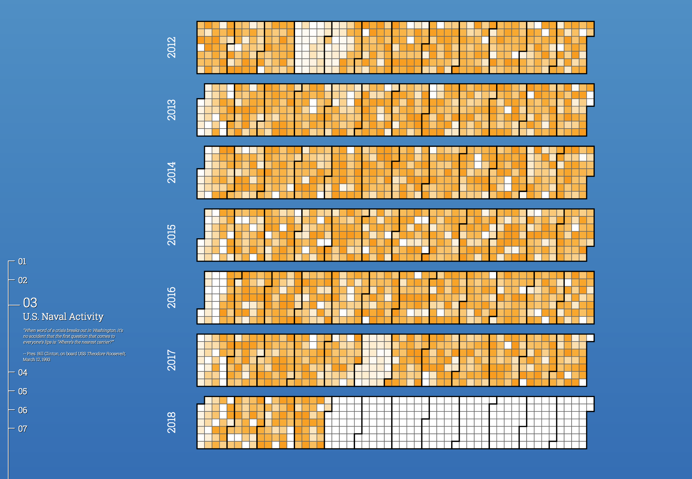

## Strength in Numbers: Mapping U.S. Naval Diplomacy, 2012-2018

[](https://sieng146.github.io/thesis/public)

Global seapower competition is intensifying. As China dredges up ≈3,200 acres of territory *ex nihilo* in the South China Sea and emplaces sea missiles astride the Philippine archipelago, and as Russia disperses its submarines more widely across the Mediterranean as it conducts simulated attack strafing runs against NATO vessels in the Baltic Sea, the Obama and Trump national security teams have faced increasingly intricate naval diplomacy and maritime security challenges in recent years. 

With these shifts in mind, this thesis examines the overall patterns in U.S. naval diplomacy worldwide from 2012 to 2018, querying diplomatic tension in the STRATFOR dataset under both the Obama and Trump administrations and comparing them to vessel movements as well as freedom of navigation operations (FONOPS). In addition, this thesis examines the geostrategic impact of Secretary of State Hillary Clinton’s diplomatic pivot to Asia in 2011 and Secretary of Defense Leon Panetta’s decision in 2012 to move 60% of the U.S. fleet to the Pacific, breaking with decades of a roughly even 50%-50% Atlantic-Pacific force posture.

Keywords: ```seablindness```    ```seapower competition```    ```thalassocracy```   ```naval diplomacy```   ```U.S. Navy```   ```aircraft carriers```   ```amphibious assault ships```   ```sea lines of communication (SLOCs)```   ```international sea lanes (ISLs)```   ```freedom of navigation (FON)```   ```regional security```   ```net assessment```   ```South China Sea (SCS)```   ```Pivot to the Pacific```   ```“The Pivot Before the Pivot”```   ```Rebalancing to Asia```   ```new National Defense Strategy (NDS)```   ```eastern Mediterranean```   ```Thucydides trap```   ```multilateralism```   ```Trump```   ```Obama```

## Bibliography

Alford, Jonathan. *Sea Power and Influence: Old Issues and New Challenges.* London: International Institute for Strategic Studies, 1980.

Anderson, Ewan W. *Strategic Minerals: The Geopolitical Problems for the United States.* New York: Praeger, 1988.

Branch, Jordan. *The Cartographic State: Maps, Territory and the Origins of Sovereignty.* Cambridge: Cambridge University Press, 2015.

Brodie, Bernard. *A Guide to Naval Strategy.* Princeton, NJ: Princeton University Press, 1944.

Brodie, Bernard. *Sea Power in the Machine Age.* Princeton, NJ: Princeton University Press, 1941.

Brzezinski, Zbigniew. *The Grand Chessboard: American Primacy and Its Geostrategic Imperatives.* New York: Basic Books, 1997.

De Blij, Harm J. Why Geography Matters: Three Challenges Facing America: Climate Change, the Rise Of China, and Global Terrorism. Oxford: Oxford University Press, 2005.


Dutton, Peter, Robert S. Ross and Øystein Tunsjø, eds. *Twenty-first Century Seapower: Cooperation and Conflict at Sea.* Abingdon: Routledge, 2013.

Elleman, Bruce A., and Sarah C. M. Paine. *Naval Blockades and Seapower: Strategies and Counter-Strategies, 1805-2005.* London: Routledge, 2006.

Friedman, Norman. *Seapower as Strategy: Navies and National Interests.* Annapolis, MD: Naval Institute Press, 2001.

Graham, Euan. *Japan's Sea Lane Security, 1940-2004: A Matter of Life and Death?* Abingdon: Routledge, 2006.

Gorshkov, Sergey G. *The Sea Power of the State.* Oxford: Pergamon Press, 1979.

Haskew, Michael E. *Aircraft Carriers: The Illustrated History of the World's Most Important Warships.* Minneapolis, MN: Zenith Press, 2016.

Horowitz, Michael C. *The Diffusion of Military Power: Causes and Consequences for International Politics.* Princeton, NJ: Princeton University Press, 2010.

Howe, Jonathan T. *Multicrises: Sea Power and Global Politics in the Missile Age.* Cambridge, MA: MIT Press, 1971.

Kadmon, Naftali. *Toponymy: the Lore, Laws and Language of Geographic Names.* New York: Vantage Press, 2000.

Koburger, Jr. Charles W. *Narrow Seas, Small Navies, and Fat Merchantmen.* New York: Praeger, 1990.

Lambeth, Benjamin S. *American Carrier Air Power at the Dawn of a New Century.* Santa Monica, CA: RAND Corporation, 2006.

Lambeth, Benjamin S. *Combat Pair: The Evolution of Air Force-Navy Integration in Strike Warfare.* Santa Monica, CA: RAND Corporation, 2006.

[Leetaru, Kalev H. and Philip A. Schrodt. "GDELT: Global Data on Events, Language, and Tone, 1979-2012," *Paper presented at the International Studies Association Annual Convention,* San Francisco, CA: April 3, 2013.](http://data.gdeltproject.org/documentation/ISA.2013.GDELT.pdf)

Lord, Carnes. *Rebalancing the Force: Basing and Forward Presence in the Asia-Pacific.* Annapolis, MD: Naval Institute Press, 2014.

McBride, William M. *Technological Change and the United States Navy, 1865-1945.* Baltimore, MD: Johns Hopkins University Press, 2000.

Modelski, George. *Seapower in Global Politics: 1494-1993.* Seattle, WA: University of Washington Press, 1988.

[O'Brien, Sean. "Crisis Early Warning and Decision Support: Contemporary Approaches and Thoughts on Future Research," *International Studies Review* 12, no. 1 (2010): 87-104.](http://onlinelibrary.wiley.com/doi/10.1111/j.1468-2486.2009.00914.x/abstract)

Rowlands, Kevin. *21st Century Gorshkov: The Challenge of Seapower in the Modern Era.* Annapolis, MD: Naval Institute Press, 2017.

Samuels, Marwyn. *Contest for the South China Sea.* Abingdon: Taylor and Francis, 2013.

[Schrodt, Philip A. "Automated Production of High-Volume, Near-Real-Time Political Event Data," *Paper presented at the “New Methodologies and Their Applications in Comparative Politics and International Relations” workshop at Princeton University,* Princeton, NJ: February 4, 2011.](http://www.princeton.edu/~pcglobal/conferences/methods/papers/schrodt.pdf)

Slater, David, and Peter James Taylor. *The American Century: Consensus and Coercion in the Projection of American Power.* Oxford: Blackwell, 1999.

Stavridis, James. *Sea Power: The History and Geopolitics of the World's Oceans.* New York: Penguin Press, 2017.

Till, Geoffrey. *Seapower: A Guide For the Twenty-First Century.* Hoboken, NJ: Taylor & Francis, 2009.

[Wagner-Pacifici, Robin, John W. Mohr, Ronald L. Breiger, Petko Bogdanov. "Graphing the Grammar of Motives in National Security Strategies: Cultural Interpretation, Automated Text Analysis, and the Drama of Global Politics," *Poetics* 41, n. 6, December 2013.](https://www.sciencedirect.com/science/article/pii/S0304422X1300065X)

Yardley, Roland F. *Increasing Aircraft Carrier Forward Presence: Changing the Length of the Maintenance Cycle.*  Santa Monica, CA: RAND Corporation, 2006.
