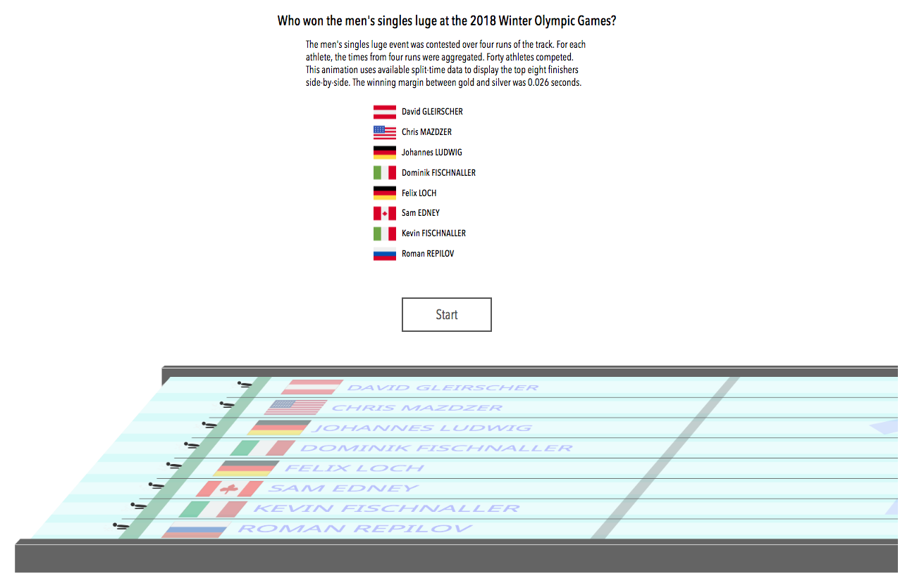

# On and Beyond the Edge

### Visual Stories of Winning Margins in Elite Sports

### Julian H. Lange

## Abstract
Olympic Games and World Championships showcase the world’s best athletes.
While medalists in elite sports earn a significant premium over fourth place finishers,
the margins of victory have become vanishingly small.
This series of interactive visualizations examines three stories from those margins.
First, situated in the 2018 Winter Olympic Games, viewers are invited
to test hypothetical scenarios in which athletes' performances improve by thin margins.
The second visualization highlights a story from the swimming pool, where technological advances
in equipment effectively changed the parameters of a sport.
Finally, viewers can re-live the 2018 Winter Olympic Games men's singles luge event via
an animation that displays the top eight athletes side-by-side on the track.

### Features
* 
* 

### Credits
Created by Julian H. Lange with data from the following sources:
* 
* 