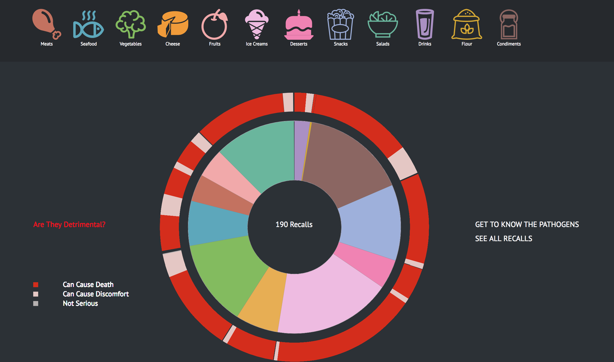

# Bacteria Invasion
## Is Your Favorite Food Contaminated?

### Abstract

Food is essential. However, when quality control fails, we can easily put ourselves in danger by consuming pathogen contaminated food. Unfortunately, documented by Food and Drug Administration, there have been over 14,600 recall cases authorized in the United States over the past 7 years, with impacts on civilizations all over the world. What is more appalling is that the number is still growing. This research project delves deeper into food safety issues and investigates their effects on civilizations. In particular, it closely analyzes food recall cases that are associated with pathogen contaminations in finding patterns of distributions of questionable food sources as well as disposing "big names" for producing these foods, serving the purpose of informing the public to be conscious of potential problems and be cautious when purchasing foods. 

*some of the main features for this project shown above*

 
